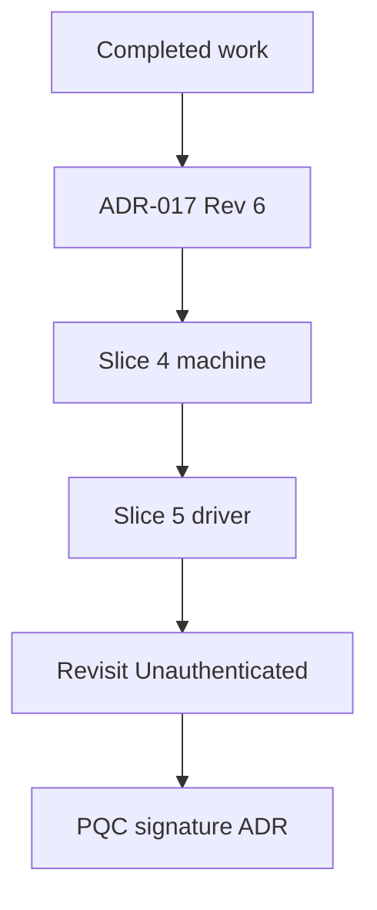

# 07-roadmap

## Purpose

This document sequences implementation work, states the current position, and records exit criteria for the next slice. Decisions live in `docs/adr/`. Schemas live in `docs/spec/`. This document cites those sources.

## Working method

Documentation leads code. An ADR or spec change precedes the code that depends on it.

One slice is one crate or one bounded concern. One agent conversation per slice. Each slice ends with a report that is independently reviewed against committed source before the next slice is scoped.

Security claims must be evidenced by tests.

Lessons that keep recurring, and that are now standing review checks:

- (a) A test must check what the code should do.
- (b) Canonical encodings are proven by byte-level fixtures.
- (c) A bound is enforced where the information to name the violation exists.
- (d) Green tests are not sufficient if they only confirm existing behavior.

## Completed work

Slice numbers appear only where a commit message or ADR-017 already uses them. `e5a5501` is Slice 3, the authentication-message slice.

| Commit(s) | Area | What landed | Governing ADR/spec |
|---|---|---|---|
| `5d63c5f` | Repository | Initial commit (README only). | None recorded |
| `b39bdd9` | Planning | Phase 3 plan in `docs/README.md`. | None recorded |
| `51e072b` | Bootstrap | Workspace skeleton, `deny.toml`, and the crypto-boundary check. | `.cursor/rules/crypto-boundary.mdc` |
| `312846f`, `06c05de`, `b9c8a2b` | mw-crypto | Public-key verifier, algorithm registry under `docs/spec/`, and secret-key zeroize (`312846f`, continued in `06c05de`). `AlgId` registry-code conversion centralized (`b9c8a2b`). | `docs/spec/algorithm-registry.md` |
| `c713068` | mw-proto framing | Frame codec, `Hello`, wire version, and algorithm-code mapping. Commit subject is "update". | ADR-015, `docs/spec/wire-registry.md`, `docs/spec/algorithm-registry.md` |
| `f2270a9` | Identity; ADR-015; ADR-016 | `NodeId`, certificate, and keystore types. ADR-015 and ADR-016 added in this commit. Commit subject is "update". | ADR-015, ADR-016 |
| `01541f8` | Transport | TLS channel, development certificate, and verify wrapper. Commit subject is "update 2". | ADR-016 |
| `9602626` | Hygiene | Stop tracking Rust build artifacts. | None recorded |
| `b1911bd` | Identity and transport (slice-one) | Boundary hardening, including subject/issuer key consistency. | ADR-017 (builds on this commit) |
| `2826b9f`, `f478136`, `7fadab0`, `bfccd91`, `3dfc86a` | ADR-017 | Mesh identity and TLS channel binding. Revision 5 was recorded and corrected before push. | ADR-017 |
| `b2ee556`, `9c30702`, `893c9b2`, `27e2aa0` | Bounded decode | Allocation-safe bounded types, Hello preallocation removed, allocation-discrimination tests, depth-aware violation scope. | ADR-017 |
| `7fcf808`, `2ffba60`, `984e67c`, `7632c4c`, `bd20110` | Certificate capability and wire form | Raw capability codes and validation hardening, subject-key point-validity coverage, discrimination-margin enforcement, certificate wire representation, field bounds checked before encode. | ADR-017, `docs/spec/algorithm-registry.md` |
| `e5a5501` | Authentication messages (Slice 3) | `AuthInit`, `AuthResponse`, `AuthConfirm`, and `AuthTranscriptV1`. Hello carries unknown algorithm codes. `MAX_HELLO_ALGS` allocated. | ADR-017 |

## Current position

HEAD is `e5a5501`. After this slice, ADR-017 is Revision 6. `mw-proto` has the authentication messages and `AuthTranscriptV1`. `mw-identity` has the certificate wire form and verify ordering. `mw-transport` has the TLS channel. There is no `mw-session` crate. `crates/mw-session` is not in the workspace members list.

## Next: Slice 4, mw-session::machine

Goal: the pure `AuthMachine`, per ADR-017 §*Division of responsibility*.

First step: create `crates/mw-session` and add it to the workspace members list. Its allowed dependency edges are exactly those in ADR-017 §*Crate ownership*. It must not depend on `mw-trust`.

In scope: the machine only. Out of scope: the driver, any I/O, tokio, rustls, clocks, timers, entropy, private key types, and `AuthenticatedSession<S>` construction.

Tests: the ADR-017 §*Testing obligations* rows that are decidable at the machine level:

- Reflection, cross-session replay, MITM relay, role confusion, unknown-key-share.
- Certificate outside validity at the supplied `now`.
- Issuer and subject mismatch.
- Signature-list arity and duplicates.
- Algorithm mismatches.
- Node id checks.
- Out-of-order messages and nonce reuse.
- `SessionExpired`.

Rows that need a real stream or a TLS configuration belong to Slice 5, listed in §*Then*.

Structural checks from ADR-017 §*Testing obligations* that apply to this slice:

- `cargo tree -p mw-session --depth 1 | grep mw-trust` is empty.
- `cargo tree -p mw-session | grep -Ei 'aws-lc|ring'` is empty.
- No clock read, socket, timer, or sleep anywhere in `mw-session::machine`.
- No private key type reachable from `AuthMachine`.

Exit criteria: every machine-level row has a named test. Each negative test asserts the specific error variant, not just `is_err`. All structural checks are run, and their output is pasted in the slice report.

## Then

**Slice 5: `mw-session::driver` (async).** Owns `Unauthenticated<S>`, the pre-authentication bounds, and the driver-level rows from §*Next: Slice 4, mw-session::machine*: cumulative pre-auth bytes exceeding 16 384, a post-`AUTH_CONFIRM` frame with an invalid `AUTH_CONFIRM`, TLS 1.2 offered, and resumption or 0-RTT enabled (ADR-017 §*Testing obligations*). Binds the rule that the violation channel is never held across `.await` (ADR-017 §*Bounded-decode doctrine*).

**After Slice 5.** Revisit `Unauthenticated<S>` API narrowing once the driver's access pattern is proven (ADR-017 §*Revisit triggers*).

**Post-quantum signatures.** Not decided. ADR-017 §*Bound-constant ownership and sizing* records that a post-quantum migration moves the bound-constant family, the transcript, and the exporter-label version together. That evaluation is its own ADR.

## Sequencing

## IDs

TST and DEM IDs are defined in this document per docs discipline, and none are allocated yet. Allocation is a separate maintainer decision.
