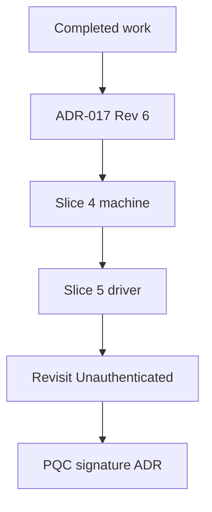

# 07-roadmap

## Purpose

This document sequences implementation work, states the current position, and records exit criteria for the next slice. Decisions live in `docs/adr/`. Schemas live in `docs/spec/`. This document cites those sources.

## Working method

Documentation leads code. An ADR or spec change precedes the code that depends on it.

One slice is one crate or one bounded concern. One agent conversation per slice. Each slice ends with a report that is independently reviewed against committed source before the next slice is scoped.

Security claims must be evidenced by tests.

Build gate: every slice's exit criteria include `cargo test --workspace` and `cargo build --workspace --all-targets`, not only the tests of the crate under change. Slice 3 changed a public `mw-proto` type and broke `mw-transport`'s tests, undetected from `e5a5501` until the Repair (post-Slice 3) slice.

Lessons that keep recurring, and that are now standing review checks:

- (a) A test must check what the code should do.
- (b) Canonical encodings are proven by byte-level fixtures.
- (c) A bound is enforced where the information to name the violation exists.
- (d) Green tests are not sufficient if they only confirm existing behavior.

## Completed work

Slice numbers are maintainer-confirmed. Rows without a slice number predate slice numbering.

| Commit(s) | Area | What landed | Governing ADR/spec |
|---|---|---|---|
| `5d63c5f` | Repository | Initial commit (README only). | None recorded |
| `b39bdd9` | Planning | Phase 3 plan in `docs/README.md`. | None recorded |
| `51e072b` | Bootstrap | Workspace skeleton, `deny.toml`, and the crypto-boundary check. | `.cursor/rules/crypto-boundary.mdc` |
| `312846f`, `06c05de`, `b9c8a2b` | mw-crypto | Public-key verifier, algorithm registry under `docs/spec/`, and secret-key zeroize (`312846f`, continued in `06c05de`). `AlgId` registry-code conversion centralized (`b9c8a2b`). | `docs/spec/algorithm-registry.md` |
| `c713068` | mw-proto framing | Frame codec, `Hello`, wire version, and algorithm-code mapping. Commit subject is "update". | ADR-015, `docs/spec/wire-registry.md`, `docs/spec/algorithm-registry.md` |
| `f2270a9` | Identity; ADR-015; ADR-016 | `NodeId`, certificate, and keystore types. ADR-015 and ADR-016 added in this commit. Commit subject is "update". | ADR-015, ADR-016 |
| `01541f8` | Transport | TLS channel, development certificate, and verify wrapper. Commit subject is "update 2". | ADR-016 |
| `9602626` | Hygiene | Stop tracking Rust build artifacts. | None recorded |
| `b1911bd` | Identity and transport (slice-one) | Boundary hardening, including subject/issuer key consistency. | ADR-017 (builds on this commit) |
| `2826b9f`, `f478136`, `7fadab0`, `bfccd91`, `3dfc86a` | ADR-017 | Mesh identity and TLS channel binding. Revision 5 was recorded and corrected before push. | ADR-017 |
| `b2ee556`, `9c30702`, `893c9b2`, `27e2aa0` | Bounded decode (Slice 1 / 1b) | Allocation-safe bounded types, Hello preallocation removed, allocation-discrimination tests, depth-aware violation scope. | ADR-017 |
| `7fcf808`, `2ffba60`, `984e67c`, `7632c4c`, `bd20110` | Certificate capability and wire form (Slice 2 (2a/2b)) | Raw capability codes and validation hardening, subject-key point-validity coverage, discrimination-margin enforcement, certificate wire representation, field bounds checked before encode. Code comments label `7fcf808` as 2a and `7632c4c` as 2b. `2ffba60`, `984e67c`, and `bd20110` carry no label, so the group is not split. | ADR-017, `docs/spec/algorithm-registry.md` |
| `e5a5501` | Authentication messages (Slice 3) | `AuthInit`, `AuthResponse`, `AuthConfirm`, and `AuthTranscriptV1`. Hello carries unknown algorithm codes. `MAX_HELLO_ALGS` allocated. | ADR-017 |
| `3dac79a`, `65723e7`, and the roadmap commit that adds this row | Repair (post-Slice 3) | `tls_channel.rs` builds `Hello` from raw registry codes and compiles again. `Hello` bound pinned at `MAX_HELLO_ALGS + 1` with byte fixtures. Workspace build gate, slice numbering, obligation coverage, and the Hello placement decision recorded here. | ADR-017 |

## Current position

HEAD is `e5a5501`. After this slice, ADR-017 is Revision 6. `mw-proto` has the authentication messages and `AuthTranscriptV1`. `mw-identity` has the certificate wire form and verify ordering. `mw-transport` has the TLS channel. There is no `mw-session` crate. `crates/mw-session` is not in the workspace members list.

## Next: Slice 4, mw-session::machine

Goal: the pure `AuthMachine`, per ADR-017 §*Division of responsibility*.

First step: create `crates/mw-session` and add it to the workspace members list. Its allowed dependency edges are exactly those in ADR-017 §*Crate ownership*. It must not depend on `mw-trust`.

In scope: the machine only. Out of scope: the driver, any I/O, tokio, rustls, clocks, timers, entropy, private key types, and `AuthenticatedSession<S>` construction.

Tests: the ADR-017 §*Testing obligations* rows that are decidable at the machine level:

- Reflection, cross-session replay, MITM relay, role confusion, unknown-key-share.
- Certificate outside validity at the supplied `now`.
- Issuer and subject mismatch.
- Signature-list arity and duplicates.
- Algorithm mismatches.
- Node id checks.
- Out-of-order messages and nonce reuse.
- `SessionExpired`.

Rows that need a real stream or a TLS configuration belong to Slice 5, listed in §*Then*.

Structural checks from ADR-017 §*Testing obligations* that apply to this slice:

- `cargo tree -p mw-session --depth 1 | grep mw-trust` is empty.
- `cargo tree -p mw-session | grep -Ei 'aws-lc|ring'` is empty.
- No clock read, socket, timer, or sleep anywhere in `mw-session::machine`.
- No private key type reachable from `AuthMachine`.

Exit criteria: every machine-level row has a named test. Each negative test asserts the specific error variant, not just `is_err`. All structural checks are run, and their output is pasted in the slice report.

## Then

**Slice 5: `mw-session::driver` (async).** Owns `Unauthenticated<S>`, the pre-authentication bounds, and the driver-level rows from §*Next: Slice 4, mw-session::machine*: cumulative pre-auth bytes exceeding 16 384, a post-`AUTH_CONFIRM` frame with an invalid `AUTH_CONFIRM`, TLS 1.2 offered, and resumption or 0-RTT enabled (ADR-017 §*Testing obligations*). Binds the rule that the violation channel is never held across `.await` (ADR-017 §*Bounded-decode doctrine*).

**After Slice 5.** Revisit `Unauthenticated<S>` API narrowing once the driver's access pattern is proven (ADR-017 §*Revisit triggers*).

**Post-quantum signatures.** Not decided. ADR-017 §*Bound-constant ownership and sizing* records that a post-quantum migration moves the bound-constant family, the transcript, and the exporter-label version together. That evaluation is its own ADR.

## Testing obligation coverage

One row per row of ADR-017 §*Testing obligations*, as of the Repair (post-Slice 3) slice.

- Level: where the cited evidence sits, or where the row will be tested if there is none. decode is `mw-proto`, identity is `mw-identity`, machine is Slice 4, driver is Slice 5.
- Covered: a named test asserts the variant or property the row names. Owner is Done.
- Partial: a test asserts a lower-level variant (for example `BoundExceeded` where the row names `LimitExceeded`), or covers only part of the row. Owner is the slice that maps it to the session error.
- Planned: no evidence yet; Owner is the slice that will add it.
- Gap: no test and no owner.
- Owner for Partial rows follows ADR-017 §*Division of responsibility*: the machine "consumes validated inputs", and the driver "performs framed I/O under the pre-authentication bounds". So `ProtocolViolation`, `UnsupportedAlgorithm`, and validity rows go to Slice 4; `LimitExceeded`, `MalformedMessage`, `MalformedCertificate`, and `UnknownMessageType` rows go to Slice 5.

**Positive**

| Obligation | Level | Status | Evidence | Owner |
|---|---|---|---|---|
| Mutual authentication over `tokio::io::duplex` reaches `AuthenticatedSession` with correct peer `NodeId` and capabilities | driver | Planned | None | Slice 5 |
| `AuthTranscriptV1` golden vector | decode | Covered | `auth_transcript_v1_golden_vector_is_permanently_frozen` (mw-proto) | Done |
| `certificate_signing_bytes` golden vectors unchanged | identity | Covered | `golden_vector_canonical_form_and_node_id_are_unchanged` (mw-identity) | Done |
| `certificate_wire_bytes` round-trips; re-encode equals original | identity | Covered | `wire_golden_vector_decodes_and_reencodes_identically`, `sign_to_wire_from_wire_verify_round_trip_preserves_signing_bytes` (mw-identity) | Done |
| Exporter is 32 bytes, deterministic within a session, distinct across sessions | driver | Gap | None | None |
| Certificate with `MAX_CERT_CAPABILITIES` capabilities encodes within `MAX_CERTIFICATE_WIRE_BYTES` | identity | Covered | `sixty_four_capabilities_encode_within_wire_byte_budget` (mw-identity) | Done |
| Unknown capability code round-trips the wire form; signing bytes unchanged | identity | Covered | `unknown_capability_code_survives_wire_decode_and_reencodes`, `unknown_capability_code_signing_bytes_indifferent_to_resolvability` (mw-identity) | Done |
| `has_capability` correct for a known code alongside an unknown code | identity | Covered | `has_capability_searches_raw_codes_with_unknown_present` (mw-identity) | Done |
| `Hello` with an unknown algorithm code is accepted | decode | Covered | `unknown_hello_algorithm_code_is_accepted` (mw-proto) | Done |
| `Hello` with exactly `MAX_HELLO_ALGS` codes round-trips | decode | Covered | `encode_decode_symmetry_at_bound_edges`, `hello_bound_plus_one_is_rejected_at_exact_edge` (mw-proto) | Done |
| `AuthTranscriptV1` worst case pinned at 4293 bytes | decode | Covered | `auth_transcript_worst_case_fits_max_auth_transcript_bytes` (mw-proto) | Done |

**Negative**

| Obligation | Level | Status | Evidence | Owner |
|---|---|---|---|---|
| Reflection: rejected on `role` | machine | Planned | None | Slice 4 |
| Cross-session replay: rejected on `channel_binding` | machine | Planned | None | Slice 4 |
| MITM relay: rejected on `channel_binding` | machine | Planned | None | Slice 4 |
| Role confusion: rejected | machine | Planned | None. `transcript_role_accepts_client_and_server_rejects_others` (mw-proto) tests the role byte decode, not role confusion. | Slice 4 |
| Unknown-key-share: rejected | machine | Planned | None | Slice 4 |
| Certificate outside validity: `PeerCertificateNotValidAt` | identity | Partial | `certificate_is_expired_at_and_after_valid_until`, `certificate_is_not_yet_valid_before_valid_from` (mw-identity) assert `Expired` and `NotYetValid` | Slice 4 |
| Wrong-but-valid issuer key: `IssuerKeyMismatch`, not `BadSignature` | identity | Covered | `wrong_issuer_key_fails_as_issuer_mismatch_not_bad_signature`, `expired_certificate_with_wrong_issuer_reports_issuer_mismatch` (mw-identity) | Done |
| Subject mismatch: `SubjectKeyMismatch` | identity | Covered | `subject_key_mismatch_is_rejected_by_sign_and_verify` (mw-identity) | Done |
| Tampered proof signature: `AuthProofInvalid` | machine | Planned | None. `tampered_signature_bytes_fail_as_bad_signature` (mw-identity) covers the certificate signature, not the proof. | Slice 4 |
| Empty signature list: `ProtocolViolation` | machine | Planned | None. `auth_confirm_empty_signature_list_decodes_successfully` (mw-proto) shows decode accepts it, so rejection belongs to the machine. | Slice 4 |
| Two signatures: `ProtocolViolation` | machine | Planned | None. `auth_response_two_signatures_decodes_successfully` (mw-proto) shows decode accepts it. | Slice 4 |
| Duplicate algorithm codes: `ProtocolViolation` | machine | Planned | None | Slice 4 |
| Unknown algorithm code: `UnsupportedAlgorithm` | decode | Partial | `alg_from_u16_rejects_unknown_code` (mw-proto) asserts `UnknownAlgorithm(0x00FF)` | Slice 4 |
| Unknown signature algorithm code: `UnsupportedAlgorithm` | decode | Partial | `unknown_wire_signature_algorithm_is_rejected_with_code` (mw-proto) and `unknown_signature_algorithm_code_is_rejected_with_code` (mw-identity) assert `UnknownAlgorithm` | Slice 4 |
| Certificate `public_key` not a well-formed Ed25519 point: rejected by `sign` and `verify` with a typed error | identity | Covered | `subject_public_key_invalid_point_rejected_by_sign_and_verify`, `subject_public_key_of_wrong_length_rejected_by_sign_and_verify` (mw-identity) assert `MalformedSubjectPublicKey` | Done |
| `NodeId` with non-zero trailing bits: rejected | identity | Covered | `node_id_rejects_nonzero_trailing_bits` (mw-identity) | Done |
| `NodeId` lowercase input: rejected | identity | Covered | `node_id_rejects_lowercase_input` (mw-identity) | Done |
| Resolved-subset accessor omits an unknown capability code; raw accessor includes it | identity | Covered | `capability_codes_includes_unknown_known_capabilities_omits_it` (mw-identity) | Done |
| Signature algorithm ≠ `auth_algorithm`: `UnsupportedAlgorithm` | machine | Planned | None | Slice 4 |
| Signature algorithm ≠ certificate key algorithm: `UnsupportedAlgorithm` | machine | Partial | `mismatched_alg_id_is_rejected` (mw-crypto) asserts `AlgMismatch` at the primitive. mw-crypto has no level in this table. | Slice 4 |
| Node id unparseable: `ProtocolViolation` | identity | Partial | `malformed_node_id_strings_are_rejected` (mw-identity) asserts `MalformedNodeId` | Slice 4 |
| Node id ≠ certificate subject: `ProtocolViolation` | machine | Planned | None | Slice 4 |
| Exact-length field with 31 or 33 bytes: `ProtocolViolation` | decode | Partial | `transcript_exact_length_fields_reject_len_minus_one_and_plus_one`, `auth_init_encode_rejects_non_exact_nonce` (mw-proto) assert `ExactLength` | Slice 4 |
| Certificate with 65 capabilities: `LimitExceeded` | identity | Partial | `capability_count_bound_enforced_in_sign_and_verify` asserts `TooManyCapabilities`; `declared_capability_count_one_over_max_with_bytes_present_is_bound_exceeded` asserts `Wire(BoundExceeded)` (mw-identity) | Slice 5 |
| Certificate exceeding `MAX_CERTIFICATE_WIRE_BYTES`: `LimitExceeded` | identity | Partial | `twenty_forty_nine_bytes_of_garbage_is_wire_too_large_not_parse_error` (mw-identity) asserts `WireTooLarge`; `declared_certificate_length_above_max_is_bound_exceeded` (mw-proto) asserts `BoundExceeded` | Slice 5 |
| Each message exceeding its payload bound: `LimitExceeded` | decode | Partial | `input_above_max_auth_bytes_is_message_too_large_before_parsing` (mw-proto) asserts `MessageTooLarge` for `AuthInit`, `AuthResponse`, `AuthConfirm`; `oversized_payload_declaration_is_rejected` (mw-proto) asserts `PayloadTooLarge` at the frame | Slice 5 |
| Tiny input declaring an enormous vector length: rejected promptly, no oversized allocation | decode | Covered | mw-proto: `vec_tiny_input_with_enormous_declared_count_is_rejected_promptly`, `bytes_tiny_input_with_enormous_declared_len_is_rejected_promptly`, `hello_enormous_declared_alg_count_allocates_nothing_large`, `auth_init_enormous_declared_certificate_len_allocates_nothing_large`, `auth_confirm_enormous_declared_signature_count_allocates_nothing_large`. mw-identity: `enormous_declared_capability_count_allocates_nothing_large` and the other `enormous_declared_*` tests. No `AuthResponse`-specific test; it uses the same bounded types. | Done |
| Non-canonical certificate encoding: `MalformedCertificate` | identity | Partial | `overlong_varint_in_capability_count_is_non_canonical`, `overlong_varint_in_timestamp_is_non_canonical` (mw-identity) assert `NonCanonicalEncoding` | Slice 5 |
| Trailing bytes after any message: `MalformedMessage` | decode | Partial | `one_trailing_byte_is_trailing_bytes_not_non_canonical` (mw-proto, `AuthConfirm`), `hello_from_bytes_rejects_trailing_bytes` (mw-proto), `decode_exact_rejects_one_trailing_byte` (mw-proto) assert `TrailingBytes`. No `AuthInit` or `AuthResponse` trailing-byte test. | Slice 5 |
| Unknown message code: `UnknownMessageType`, no panic | decode | Partial | `message_type_codes_and_from_u16_are_exhaustive` (mw-proto) asserts `MessageType::from_u16(0xFFFF)` is `None` | Slice 5 |
| Message code `0x0000`: rejected | decode | Partial | `message_type_codes_and_from_u16_are_exhaustive` (mw-proto) asserts `MessageType::from_u16(0x0000)` is `None`. Nothing rejects a frame yet. | Slice 5 |
| Out-of-order message; nonce reuse: `ProtocolViolation` | machine | Planned | None | Slice 4 |
| Cumulative pre-auth bytes exceeding 16 384: `LimitExceeded` | driver | Planned | None | Slice 5 |
| Post-`AUTH_CONFIRM` frame with invalid `AUTH_CONFIRM`: never processed | driver | Planned | None | Slice 5 |
| `now >= session_valid_until`: `SessionExpired` | machine | Planned | None | Slice 4 |
| TLS 1.2 offered: refused before authentication | driver | Planned | None. `tls13_hello_frame_round_trips_over_duplex` (mw-transport) asserts TLS 1.3 was negotiated, not that TLS 1.2 is refused. | Slice 5 |
| Resumption or 0-RTT enabled: configuration rejected | driver | Planned | None | Slice 5 |

**Structural**

| Obligation | Level | Status | Evidence | Owner |
|---|---|---|---|---|
| `cargo tree -p mw-transport --depth 1` has no `mw-crypto`, `mw-identity`, or `mw-session` edge | structural | Covered | Run in the Repair (post-Slice 3) slice report; output empty. Manual, not automated. | Done |
| `cargo tree -p mw-transport` has no `aws-lc` or `ring` | structural | Covered | Run in the Repair (post-Slice 3) slice report; output empty. Manual, not automated. | Done |
| `cargo tree -p mw-session` has no `aws-lc` or `ring` | structural | Planned | None; crate does not exist | Slice 4 |
| `cargo tree -p mw-session --depth 1` has no `mw-trust` | structural | Planned | None; crate does not exist | Slice 4 |
| No clock read, socket, timer, or sleep in `mw-session::machine` | structural | Planned | None | Slice 4 |
| No private key type reachable from `AuthMachine` | structural | Planned | None | Slice 4 |
| No fixed-size crypto array in any `mw-proto` wire or spec structure | structural | Gap | No test or defined check | None |

**Outside ADR-017's list**

| Obligation | Level | Status | Evidence | Owner |
|---|---|---|---|---|
| `Hello` at `MAX_HELLO_ALGS + 1` rejected as `BoundExceeded { declared: 65, max: 64 }` on construct and decode | decode | Covered | `hello_bound_plus_one_is_rejected_at_exact_edge` (mw-proto) | Done |

Counts over the 55 ADR-017 rows: 18 Covered, 13 Partial, 22 Planned, 2 Gap.

## Open decisions

**Hello placement relative to `AUTH_INIT`.** Unspecified. ADR-017 §*Authentication flow* lists only `AUTH_INIT`, `AUTH_RESPONSE`, and `AUTH_CONFIRM` after the TLS handshake.

- If Hello is exchanged before authentication completes, it counts against the 16 384-byte pre-auth budget, and `MAX_HELLO_ALGS` belongs in ADR-017 §*Pre-authentication resource bounds*.
- If Hello is exchanged after, the driver must reject a pre-auth Hello.

`tls_channel.rs` sends Hello right after the handshake. That is a test artifact from transport slice 1, not a specification. This must be decided in an ADR-017 revision before Slice 5.

## Sequencing

## IDs

TST and DEM IDs are defined in this document per docs discipline, and none are allocated yet. Allocation is a separate maintainer decision.
