# MESHWARDEN — System Architecture (Phase 3)

> **Status:** Draft v0.1 — Phase 3 deliverable
> **Stack:** All-Rust. Agent: `tokio` + `rustls` (TLS 1.3) + RustCrypto (`ed25519-dalek`, `x25519-dalek`). Control plane: `axum`. Static `musl` binaries per arch.
> **Diagrams:** Mermaid (renders in Cursor preview and GitHub).

---

## 1. Coordination Architecture — Evaluation & Recommendation

Three coordination models were evaluated against the requirement criteria. Scores are 1 (poor) – 5 (excellent) for a **solo developer building a 3–6 node PoC in 12 weeks**, with an eye toward later scale.

| Criterion | (1) Fully P2P | (2) Federated + ephemeral coordinator | (3) Hybrid (federated data plane + optional admin plane) |
|---|:--:|:--:|:--:|
| Resilience | 5 | 4 | 4 |
| Scalability | 3 | 4 | 4 |
| Complexity (lower = better) | 1 | 3 | 3 |
| Latency | 3 | 4 | 4 |
| Offline operation | 5 | 4 | 4 |
| Security | 3 | 4 | 4 |
| Ease of deployment | 2 | 4 | 4 |
| Suitability for old hardware | 2 | 4 | 4 |
| Resistance to compromised coordinator | 5 (n/a) | 3 | 4 |
| Recovery from partition | 4 | 4 | 4 |
| **Fit for 12-week solo PoC** | **Low** | **High** | **High** |

**Recommendation: (3) Hybrid.** The *data plane* uses the federated-cluster pattern — nodes form a cluster with an **ephemeral, re-electable coordinator role**; the *control plane* (CA, policy, approval, dashboard) is an **optional administrative service off the critical path**. This is exactly what the PRD demands (`NFR-1`, `SEC-8`): no permanent central server for task execution, but an admin console for observability, policy, and human approval that the mesh survives without.

At PoC scale (3–6 nodes) this collapses to **a single cluster with one elected coordinator plus the admin plane**. The federation dimension (multiple clusters, cross-cluster reconciliation) is exercised in simulation (Phase 7) rather than physical hardware.

Fully-P2P was rejected for the PoC: Byzantine agreement, Sybil resistance, and CRDT conflict machinery are too much surface for one developer in 12 weeks, and consensus overhead is unkind to 1 GB nodes. Its strengths (no SPOF) are preserved anyway because the coordinator is a *role*, not infrastructure.

### The compromised-coordinator story (design crux)

The coordinator is deliberately **not a trust anchor**. It performs liveness/efficiency functions only:

- **It does:** aggregate capability/resource ads, assign work units and issue leases, aggregate results for verification, track cluster membership.
- **It does NOT:** vouch for result correctness, grant trust or privilege, approve sensitive actions, or hold any identity-signing authority.

Therefore a compromised coordinator can at worst mis-schedule, drop, or delay work (all detectable via lease timeouts and reassignment) or attempt to bias verification (defeated because verification rules are deterministic and independently recomputable by any node, and everything is hash-chain audited). It **cannot** forge node-signed results, mint identities, or authorize a sensitive action. Result integrity and authorization never depend on the coordinator.

### Evolution path
- **PoC:** 1 cluster, 1 elected coordinator, optional admin plane.
- **Scale:** many clusters (squad/platoon/company analogy), cross-cluster gossip + reconciliation, multiple admin consoles with quorum approval.
- **Hardening:** add BFT verification quorums and threshold signatures for the highest-impact tasks, moving selected functions toward the fully-P2P end of the spectrum where warranted.

---

## 2. Binary / Component Set (all Rust)

| Binary | Role | Runs where |
|---|---|---|
| `mw-agent` | Node agent; includes worker + **coordinator role** (role-activated, same binary) | Every node |
| `mw-ca` | Enrollment Authority / CA; issues short-lived certs; holds the highest-value signing key | ≥4 GB bootstrap node (management) |
| `mw-control` | Admin API (`axum`) + approval service + authoritative policy source + audit aggregator + dashboard | ≥4 GB bootstrap node (management) |
| `mw-cli` | Operator CLI (submit tasks, approve, inspect) | Operator workstation |
| `mw-sim` | Simulation harness — spins up N agents in netns/containers for scale + partition testing | Any capable node |

Control-plane binaries (`mw-ca`, `mw-control`) are **off the critical path**: the data plane keeps executing authorized, unexpired, leased work when they are unreachable.

---

## 3. Component Diagram

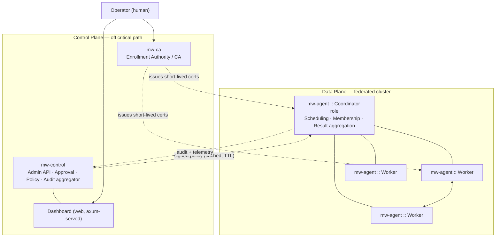

---

## 4. Node Architecture

The agent is split into a **small privileged core (the TCB)** and **sandboxed workloads with no ambient authority**. Workloads never touch keys, the network, or the filesystem except through grants named in the task manifest.

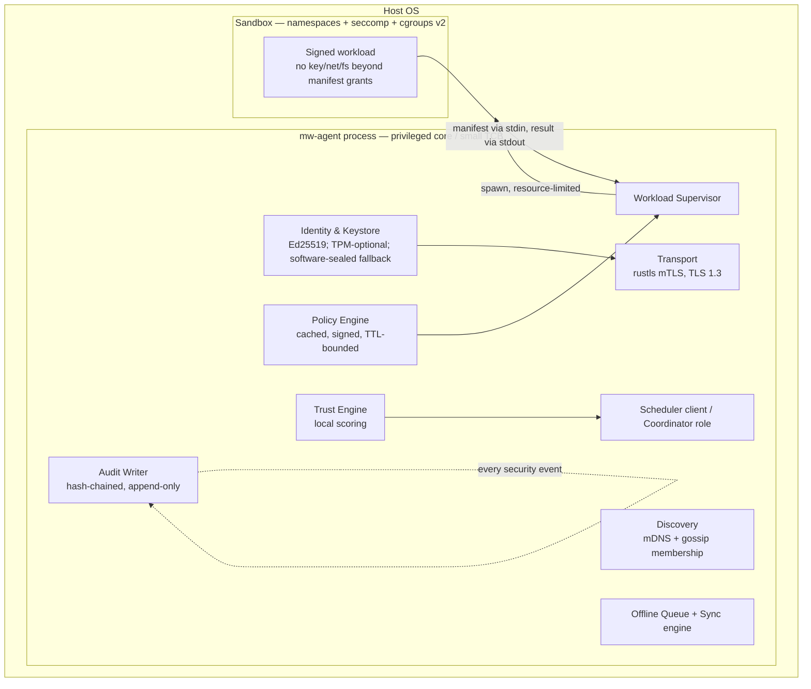

**TCB minimization:** identity, transport, policy enforcement, and audit are the only privileged concerns. Everything computational runs in the sandbox. This keeps the attack surface that must be trusted for *integrity* small and reviewable.

---

## 5. Network Architecture

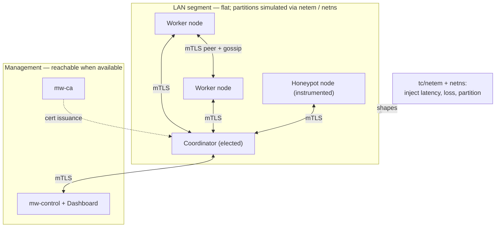

All links are mutually authenticated TLS 1.3; **a valid connection conveys no trust** (`SEC-1`). Discovery is mDNS/DNS-SD on the segment for bootstrap, with gossip for membership and liveness. Degraded/partitioned conditions are produced with `tc qdisc netem` and Linux network namespaces so DDIL behavior is testable without physical distance.

---

## 6. Trust Boundaries

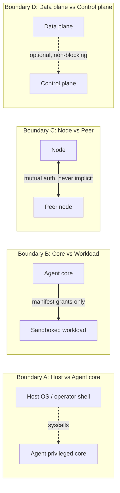

Highest-value asset: the **`mw-ca` signing key** (compromise = ability to mint identities). It lives only on the management node, is never distributed, and is the top target in the Phase 4 threat model. Node private keys are the next tier and never leave their node (TPM-sealed where available, software-sealed otherwise).

---

## 7. Identity Lifecycle

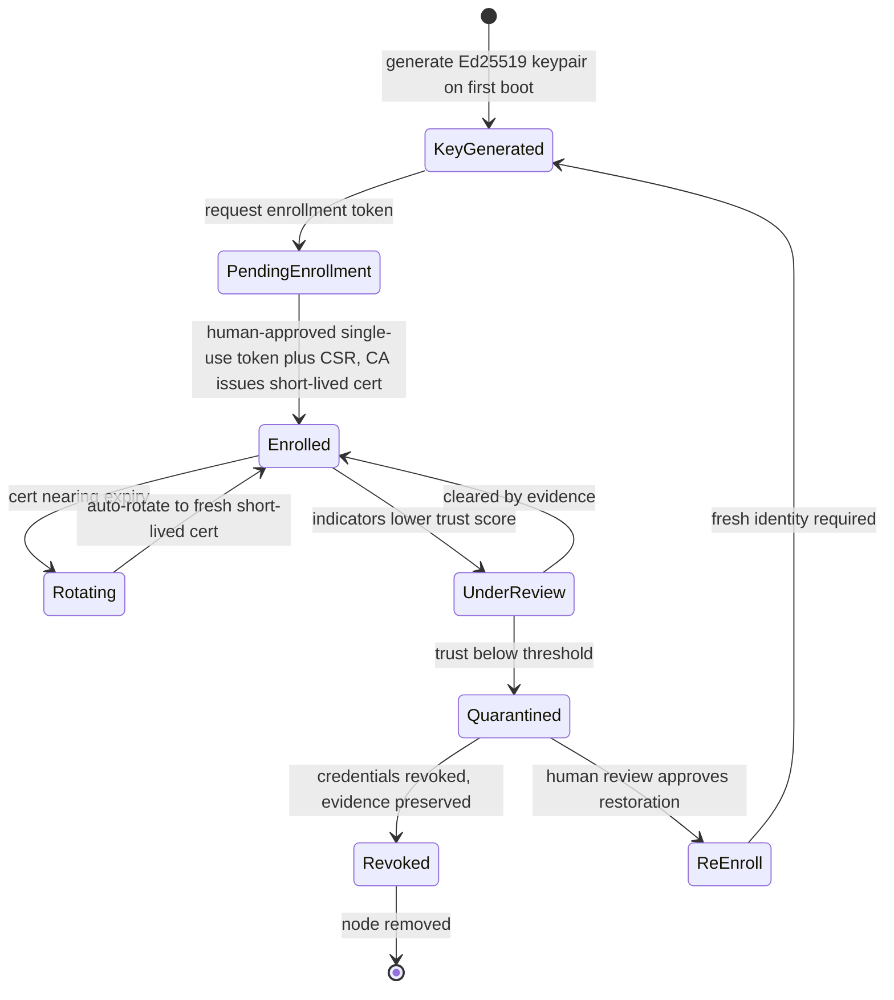

Restoration never reinstates the old credential — a reviewed node re-enrolls with a fresh identity, closing the door on cloned-key reuse.

---

## 8. Task Lifecycle

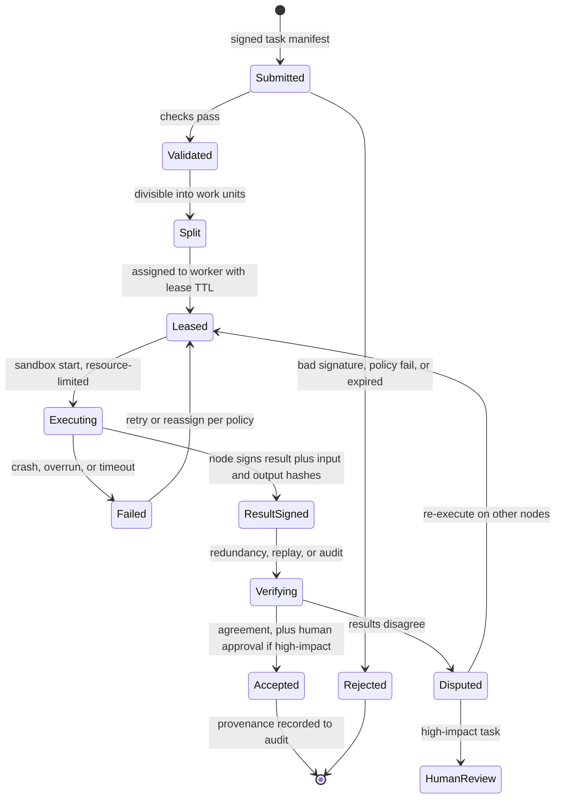

---

## 9. Data Flow

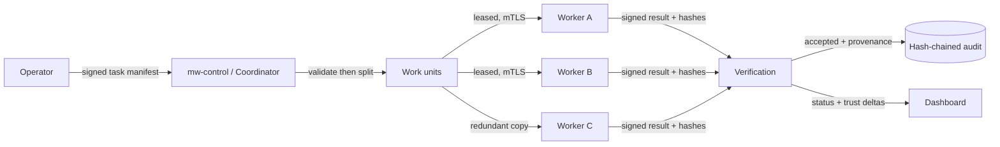

---

## 10. Enrollment Flow

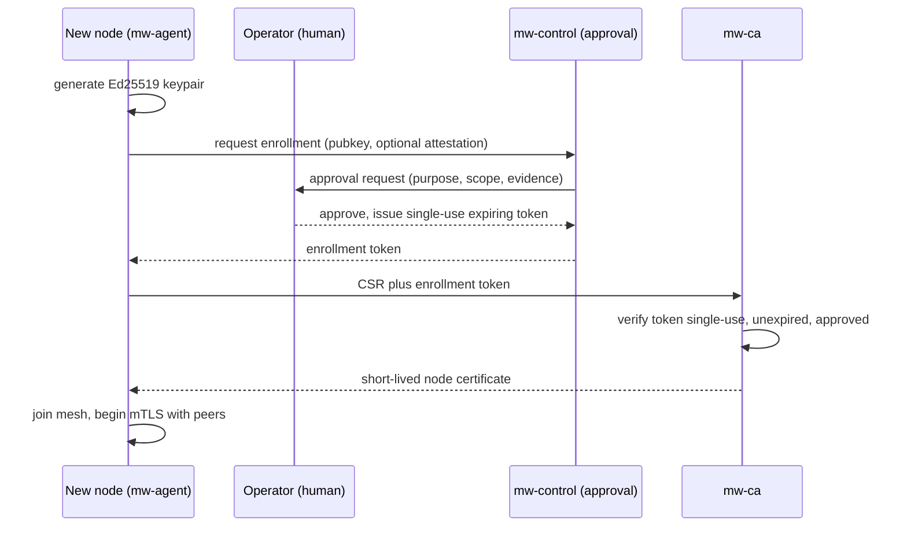

---

## 11. Offline Workflow

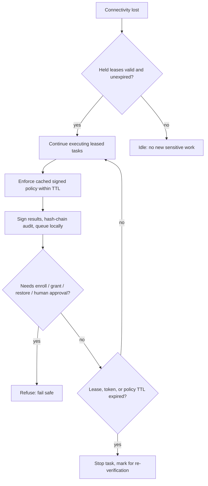

Offline permissions are strictly the intersection of what was already leased and what cached, unexpired policy allows. Nothing that grants new authority can happen without the human, and the human path fails safe.

---

## 12. Reconnection Workflow

```mermaid
sequenceDiagram
    participant N as Reconnecting node
    participant P as Peer / coordinator
    participant CT as mw-control
    N->>P: mTLS re-authentication
    P-->>N: nonce challenge; verify cert not revoked
    N->>CT: fetch revocation list and current signed policy
    CT-->>N: CRL plus policy
    N->>N: reconcile clock drift; drop actions on expired windows
    N->>CT: submit queued results and audit with local hashes
    CT->>CT: dedupe by task and unit id; verify hash chains
    CT-->>N: report conflicts if any
    N->>P: re-verify disputed results; escalate high-impact to human
```

---

## 13. Quarantine Workflow (graduated response)

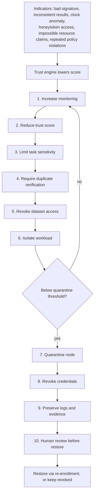

Quarantine isolates the offending node without disrupting the rest of the cluster (`FR-18`): its leases are reassigned, its peers drop its sessions, and unaffected work continues.

---

## 14. Update Workflow (signed, human-approved, rollback-safe)

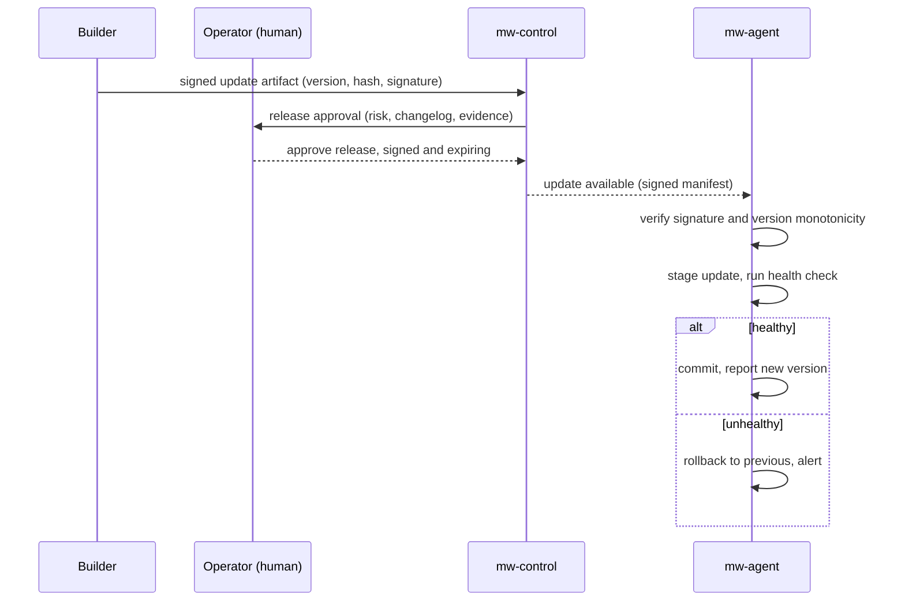

---

## 15. Human-Approval Workflow

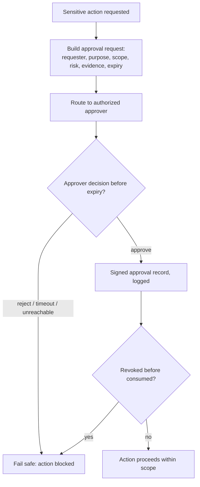

Sensitive actions (`HITL-1..3`): approving a node, granting sensitive-dataset access, assigning a high-priority mission, releasing an update, restoring a quarantined node, changing policy, exporting audit evidence, and approving a simulated drone route. Every one produces a signed, expiring, revocable approval record.

---

## 16. From PoC to Proposal (architecture evolution)

| Dimension | PoC | Proposal / scale |
|---|---|---|
| Clusters | 1 (single elected coordinator) | Many, cross-cluster gossip + reconciliation |
| Coordinator | Ephemeral role, plain election | BFT quorum for high-impact scheduling |
| Verification | Redundancy + replay + audit | Threshold signatures, trusted-verifier quorums |
| Identity | Software-sealed keys, TPM-optional | TPM/attestation default, DID interop |
| Approval | Single admin | Multi-admin quorum, m-of-n |
| Audit | Hash-chained log | Merkle-chained, cross-node anchored |
| Crypto | Ed25519/X25519 | Post-quantum hybrid |

Nothing in the PoC data-plane contracts (signed manifests, node-signed results, coordinator-as-non-trust-anchor) needs to change to reach the scaled design — the scale story is additive, which is exactly the narrative the proposal wants.

---

*End of Phase 3. Phase 4 (threat model, STRIDE) builds directly on the trust boundaries and asset list above.*